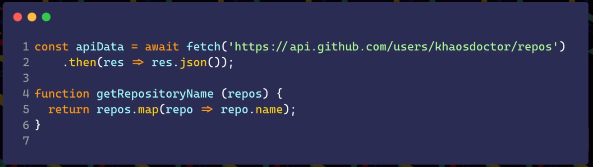

# O que é typescript?

[JavaScript With Syntax For Types.](https://www.typescriptlang.org/)

Desenvolvida pela microsoft em 2012

Transpila para JavaScript e adiciona tipagem no desenvolvimento

Desenvolvido por Anders Hejsberg que também fundou o C# e Delphi

Não é uma linguagem de programação, ele é um superset

Ela é uma linguagem Turing Completa (pesquisar)

[JavaScript Is Turing Complete— Explained](https://www.freecodecamp.org/news/javascript-is-turing-complete-explained-41a34287d263/)

[What is Turing Complete?](https://stackoverflow.com/a/37247136)

O TypeScript surgiu para resolver o problema do JavaScript, a escala. Enquanto times pequenos conseguem trabalhar em sincronia sem muitos problemas o JavaScript é uma ótima solução. Porém times grandes trazem problemas, principalmente quando se diz respeito a documentação. Muitas vezes o front-end vai consumir algum dado de uma API e não sabe exatamente o que aquele endpoint irá retornar, então fica a mercê de alguma documentação externa ou caso não exista (que geralmente são a maioria dos casos) precisará testar o endpoint e verificar seu retorno para então conseguir continuar desenvolvendo.

Com o TypeScript podemos tipar os dados de ponta a ponta, e deixar o código documentado. O Código fica mais seguro já que você não dá margem de erro.

TSC - TypeScript Compiler, faz a transpilação do TypeScript para JavaScript

A Tipagem é feita em tempo de desenvolvimento, quando app é rodado a tipagem é removida. Nem sempre conseguimos cumprir todos os casos, nesses cenários utilizamos o Zod.

Pode ser utilizado tanto no browser quando no servidor.

## Diferença entre TS e JS
O TypeScript não é executável nativamente, não existe runtime que executa o TypeScript nativamente, é sempre transpilado.

Antes de executar cada aplicação, é necessário uma etapa de build, mandar ele compilar de TypeScript  para JavaScript.

## Porque usar TypeScript?
O JavaScript é bom em times pequenos, porém quando você quer que seu projeto cresça o cenário muda muito.

Quando o time cresce são mais pessoas trabalhando em uma mesma base de código

Sem forma rápida de validar o que entra e sai da aplicação

Com TypeScript, temos a definição do que precisamos enviar.

Evita a necessidade de ir procurar na API pelos dados.

Detecção de erros em tempo de compilação.

Mais segurança na hora de refatorar o código

O código fica autoexplicativo

Enums não existem em JavaScript

## Instalando o NodeJS no Linux
### **Manage all your runtime versions with one tool!**
[asdf](https://asdf-vm.com/)

### Eu utilizo o NVM

[NVM](https://github.com/nvm-sh/nvm)

### **40 Comandos Linux Que Todo Usuário Deve Conhecer**

[40 Comandos Linux Que Todo Usuário Deve Conhecer](https://www.hostinger.com.br/tutoriais/comandos-linux)
